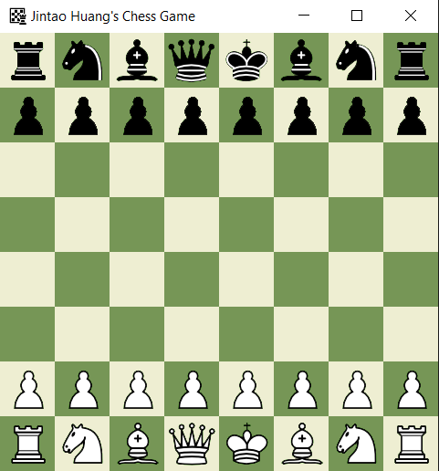
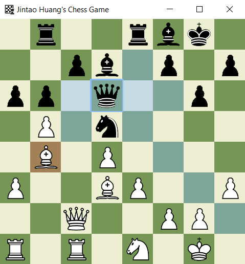
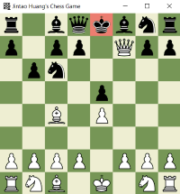

# SFML Chess
## Motivation

As a avid chess player, it always facinated me how computers handle chess's complex logic. So I went ahead and made one.

## Screenshots

 
Game Start

 
Shows Queen's moves

 
Check

 
Checkmate

## Libraries used

- [SFML](https://www.sfml-dev.org/index.php)

## Features

- Shows piece's available moves
- Castling, pawn promotions
- Check + checkmates
- Stockfish AI integration

## Credits

Big thanks to [FamTrinli from YouTube](https://www.youtube.com/watch?v=_4EuZI8Q8cs&ab_channel=FamTrinli) where he created the framework for chess graphics + moving the pieces for his 16 C++ games Youtube Series. You can find more of his works [here](https://www.youtube.com/channel/UCC7qpnId5RIQruKDJOt2exw).

## License 

This Software is distributed under the MIT license.
